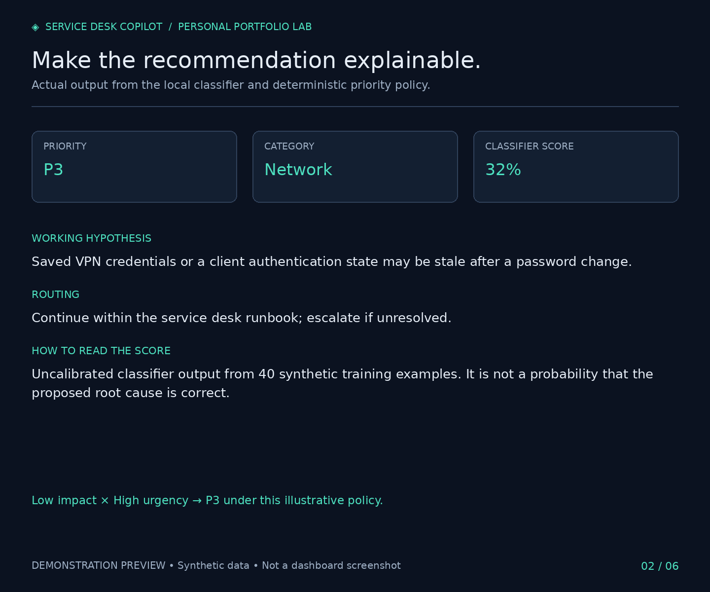
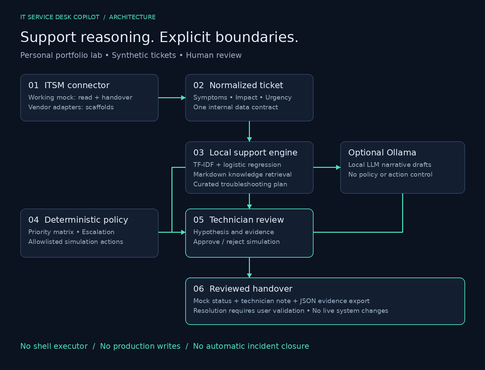

# AI-Powered IT Service Desk Copilot

**Intelligent Ticket Triage, Troubleshooting & Resolution Assistant**

A personal IT support portfolio project by **Diego Gabriel dos Santos**. Turn a synthetic incident into a structured, evidence-led support plan—with technician control at every decision.



> **Working local MVP.** No API key required. Synthetic data only. Dashboard automation is simulated. No employer deployment or production performance is claimed.

## The support problem

Incoming incidents often mix symptoms, incomplete context and urgency. Technicians need consistent categorization, a defensible priority, relevant knowledge and a clear handover—not an unverified diagnosis presented as a fix.

This copilot puts support reasoning first: identify scope, inspect evidence, follow a runbook, seek approval and validate restoration before closure.

## What works

- Eight incidents: Active Directory, VPN, DNS, printing, Windows 11, Microsoft 365, shared drives and ERP access.
- Local ML classification with explicitly uncalibrated scores and a basic manual-triage fallback.
- Impact × urgency priority recommendations with illustrative response targets.
- Lightweight retrieval over nine Markdown knowledge articles.
- Working hypotheses, troubleshooting steps and professional response drafts.
- Allowlisted automation simulations with approve/reject audit events.
- A session-local mock ITSM connector with status changes, technician notes and JSON exports.
- Optional Ollama narrative enrichment behind a provider interface.
- PowerShell lab examples, regression tests, demonstration images and interview materials.

## Local web version

A separate React/TypeScript dashboard with a Cloudflare Worker API and local D1 persistence is available under [web/](web/README.md). It runs without credentials, uses deterministic runbook matching and keeps every action simulated. Production authentication and deployment are pending; the Python lab below is preserved.

## Run locally

Python **3.11, 3.12 or 3.13** supported by the CI matrix. Windows validation passed on Python 3.13. Extract this repository and open a terminal inside `ai-it-service-desk-copilot`.

Windows PowerShell:

```powershell
py -3.13 -m venv .venv
.\.venv\Scripts\python.exe -m pip install -r requirements.txt
.\.venv\Scripts\python.exe -m streamlit run app.py
```

For Python 3.11 or 3.12, use `py -3.11` or `py -3.12` instead. Using the environment's executable avoids changing PowerShell activation policy.

macOS / Linux:

```bash
python3 -m venv .venv
.venv/bin/python -m pip install -r requirements.txt
.venv/bin/python -m streamlit run app.py
```

Open **http://localhost:8501**. Select INC-1042 and click **Analyze Ticket**. Review the tabs, then try the printer and ERP scenarios. No database or cloud account is needed.

For the exact versions exercised during the build, see `requirements-tested.txt`. It pins the tested direct dependencies; it is not a full transitive lock file.

## Demonstration workflow

1. Select a ticket; review its symptom, impact and urgency.
2. Analyze and inspect classification, proposed priority and working hypothesis.
3. Follow the troubleshooting plan and review the knowledge articles.
4. Review an action and approve or reject its **simulation**.
5. Review the response draft and add a technician note.
6. Save an in-progress or escalation decision to the mock; resolve only after explicit user validation.
7. Export the ticket analysis, notes and audit as JSON.

Session records reset on a new session. Approval never runs PowerShell. See the [three-minute demo guide](docs/demo-guide.md).

## Architecture



`Streamlit → normalized Ticket → classifier + knowledge retrieval → policy → technician review → mock handover`

The Python core is independent of the UI. `AnalysisProvider` defines the AI boundary; `TicketConnector` defines the ITSM boundary. [Architecture and limitations](docs/architecture/architecture.md).

```text
app.py                      Streamlit dashboard
src/engine.py               Local ML, retrieval and support policy
src/providers.py            Provider contract and optional Ollama adapter
src/models.py               Normalized ticket and analysis models
src/automation.py           Allowlisted simulation and audit records
src/connectors/             Working mock and explicit vendor scaffolds
sample_data/                Synthetic tickets, training examples and runbooks
knowledge_base/             Versioned troubleshooting articles
automation/                 Standalone Windows PowerShell lab scripts
tests/                      Engine, policy, provider and UI regression tests
docs/                       Architecture, validation and portfolio materials
```

## Where AI is used—and what is deterministic

| Component | Implementation |
|---|---|
| Domain classification | TF-IDF + logistic regression fitted on 40 synthetic examples |
| Knowledge retrieval | TF-IDF cosine similarity over Markdown |
| Default troubleshooting / response | Curated runbooks and response templates |
| Optional narrative enrichment | Ollama local LLM using structured JSON |
| Priority and escalation | Explicit local rules; no LLM override |
| Action approval / execution | Human decision; simulation only |

The score shown is **not root-cause confidence**. The tiny authored dataset demonstrates mechanics, not real-world accuracy. Unfamiliar wording, negation and multi-issue tickets can fail. The UI labels every diagnosis as a hypothesis.

### Optional Ollama mode

Install and run Ollama separately; download a model supported by your machine, such as `ollama pull llama3.2`. Copy `.env.example` to `.env`, set `OLLAMA_MODEL` to the installed model and select **Ollama (local LLM)** in the sidebar. The adapter accepts a loopback HTTP endpoint only and sends the synthetic ticket plus retrieved context to `/api/generate`.

No live Ollama model was available during validation. The provider's parsing, error handling and policy isolation were tested with mocked responses. Model output still requires review. If a call fails, the UI reports the failure and asks you to choose Local ML; it never labels a silent fallback as LLM output.

## ITSM integrations

The mock reads normalized incidents and records reviewed handovers. ServiceNow, Jira Service Management, GLPI and OTRS / Znuny have **non-operational extension scaffolds**. No production integration is claimed. See the [mapping contract and implementation checklist](docs/integrations.md).

## Support skills made visible

| Skill | Evidence in this project |
|---|---|
| Incident management / ITIL concepts | Scope, impact, urgency, routing and validation before closure |
| Troubleshooting | Eight realistic support runbooks with evidence-first steps |
| Windows / AD / Microsoft 365 / networking | Endpoint, identity, VPN, DNS, print and access scenarios |
| PowerShell and safe automation | Read-only diagnostics, dry-run remediation and human decisions |
| Python / AI / integration design | Typed models, trained classifier, provider and connector contracts |
| Knowledge management and documentation | Versioned articles, handover notes, exports and demo guide |

These artifacts demonstrate design and implementation skills. They do not independently prove enterprise administration proficiency or replace the author's real support experience.

## Tests

```bash
python -m pip install -r requirements-dev.txt
python -m pytest -q
```

Use the virtual environment's Python executable on Windows. GitHub Actions is configured for Python 3.11, 3.12 and 3.13; the remote workflow runs after you push. [Actual validation results and remaining checks](docs/validation.md).

## Security and operational limits

Use synthetic data only. `.env` and Streamlit secrets are ignored by Git. Never commit passwords, API tokens, real ticket exports or screenshots of corporate systems. The app does not log ticket bodies or run arbitrary commands. Audit events contain action identifiers and synthetic output; exported notes still need human review before sharing.

Bind locally; this is not a multi-user production service. There is no enterprise authentication, durable audit database or SLA clock. Security keyword checks and LLM schema validation are limited safeguards, not a complete detection or prompt-injection defense. Review the standalone PowerShell scripts and use only an authorized Windows lab. They were not executed during the Linux build.

## Screenshots and publishing

The included images are authored previews based on actual local analysis output, not dashboard screenshots. Browser access to the local app was unavailable during this build; capture real UI images on your PC using the included guide and optional script.

[Six labeled demonstration images](docs/demo-images/README.md) · [Actual screenshot capture instructions](docs/screenshots/README.md) · [English LinkedIn post](docs/linkedin/post.md) · [Interview talking points](docs/interview-talking-points.md) · [Phase-by-phase verification](docs/development-phases.md)

Repository: [diegodgspro/ai-it-service-desk-copilot](https://github.com/diegodgspro/ai-it-service-desk-copilot). LinkedIn publication remains a separate manual step.

## Next improvements

See the [web roadmap and implementation progress](docs/web-roadmap.md). The first local web version is implemented; the Python/Streamlit lab remains intact. Cloudflare deployment and Workers AI integration are pending.

Independent, de-identified evaluation data; better uncertain/multi-issue routing; one sandbox ITSM adapter; measured technician review outcomes; durable storage and access controls only when deployment requires them.

## References

Implementation references: [Streamlit AppTest](https://docs.streamlit.io/develop/api-reference/app-testing/st.testing.v1.apptest), [Ollama structured output API](https://docs.ollama.com/api/generate), [Microsoft Restart-Service](https://learn.microsoft.com/en-us/powershell/module/microsoft.powershell.management/restart-service).

License: MIT. This repository contains a personal portfolio lab, not employer code or data.
