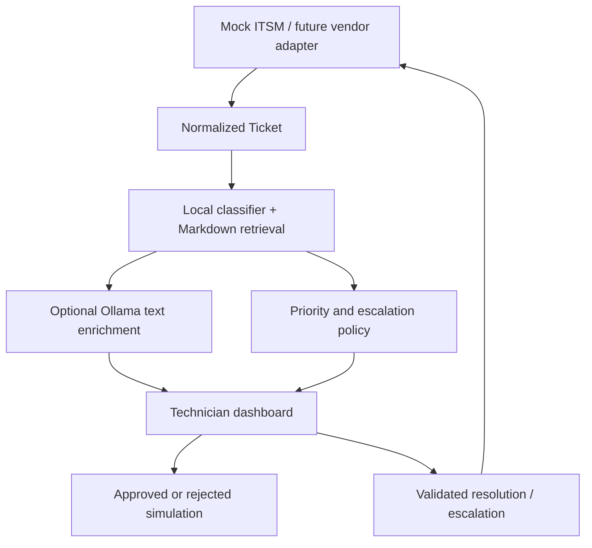

# Architecture and boundaries

The app has no database and no shell executor. The mock connector and approval events are per Streamlit session. Export incident JSON before closing the session. The model is fitted once per process and cached; no serialized model download is needed.

## Recommendation pipeline

1. TF-IDF bigrams transform the ticket; logistic regression predicts one of eight support domains.
2. A separate TF-IDF index retrieves Markdown knowledge articles by cosine similarity. The selected domain runbook is also cited when used.
3. A documented deterministic matrix calculates priority from technician-selected impact and urgency.
4. Domain runbooks supply troubleshooting steps, hypotheses and allowlisted action IDs. Low evidence or simple security indicators suppress automation and force review.
5. Optional Ollama enriches three narrative fields. It cannot alter priority, routing, action IDs or execute tools. Schema validation checks types and lengths, not factual truth or complete prompt-injection resistance.
6. The technician reviews results. Approval produces a synthetic audit record; resolution requires an explicit user-restoration checkbox.

## Model limitations

40 authored training examples, five per class, support this narrowly scoped demonstration. The eight demo tickets are distinct from training text but cover the same designed scenarios. They are regression fixtures, not an independent production benchmark. Scores are uncalibrated classifier outputs, not root-cause probabilities. TF-IDF does not understand negation reliably; multi-issue tickets, unfamiliar wording and multilingual tickets may be misclassified. The rejection heuristic and security keyword check are incomplete. Human triage is mandatory.

## Deliberately excluded

Multi-tenancy, enterprise authentication, production ticket writes, automated account changes, live PowerShell execution, vector databases, SLA timers, attachment processing and unattended resolution. These require a separate threat model and deployment design.
